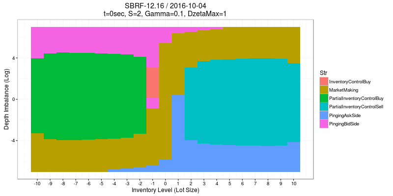

# MarketMaker
Implementation of Marketmaker trading strategy for Russian market.

* OrderBook Parameters calculation
* Trading politics calculation
* Plot strategy Map

# Install and use

* Clone repo
* Run `orderbookMain.R`

#References:

* JIANGMIN XU ["Optimal Strategies of High Frequency Traders"](https://scholar.princeton.edu/sites/default/files/JiangminXu_JobMarketPaper_Revised_0.pdf)
* Russian algotraders community [www.quantalgos.ru](http://www.quantalgos.ru/?cat=6)
